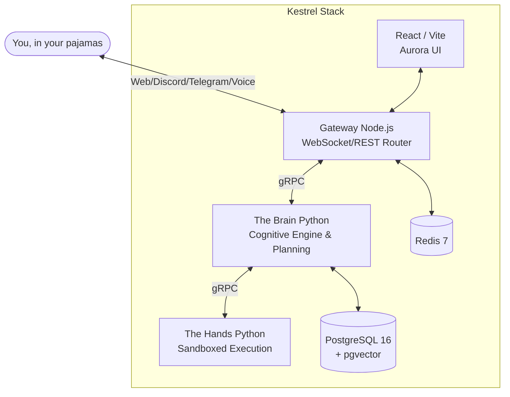

<p align="center">
  
  <h1 align="center">🦅 Kestrel (formerly Libre Bird)</h1>
  <p align="center"><strong>The dangerously autonomous, entirely self-hostable, slightly-too-smart AI agent platform.</strong></p>
  <p align="center">
    <a href="#-why-kestrel">Why Kestrel?</a> •
    <a href="#-the-brain">The Brain</a> •
    <a href="#-architecture">Architecture</a> •
    <a href="#-skills-and-tools">Skills</a> •
    <a href="#-quick-start">Quick Start</a>
  </p>
</p>

---

## 👋 Welcome to Kestrel!

Ever wanted an AI assistant that doesn't just reply to your messages, but actually thinks, argues with itself, spins up Docker containers, and executes real-world actions while you sip your coffee? Welcome to **Kestrel**.

We firmly believe your data should stay yours. Kestrel is a privacy-first, heavily-armed (with tools) AI engine that runs *entirely* on your own infrastructure. You can hook it up to lightweight local MLX models on Apple Silicon, or plug in heavy hitters like Gemini, Claude, or GPT-4.

---

## ✨ Why Kestrel?

Because typical chatbots are boring. Kestrel has agency.

- � **Multi-Phase Cognitive Loop:** It doesn't just guess an answer. It accesses persistent memory, generates a multi-step plan, uses sandboxed tools, and reflects on whether it messed up.
- 🏛️ **The Council:** Got a highly complex prompt? Kestrel convenes a literal *Multi-Agent Debate*. The Architect, the Security Expert, the Implementer, and the Devil's Advocate will argue in real-time until they reach a consensus.
- �️ **See Everything:** The *KestrelProcessBar* in the UI streams the agent's internal monologue, memory recalls, and council votes. Zero black boxes.
- 📦 **Sandboxed Toolkit:** 30+ built-in skills (web scraping, shell execution, GitHub manipulating, smart-home toggling) that run securely in isolated Docker containers via the `Hands` service.
- 📱 **Omnipresent:** Chat via the gorgeous Web UI, native macOS app, Telegram, Discord, or WhatsApp. It's the exact same persistent brain everywhere.

---

## 🏗️ Architecture (We actually refactored this recently!)

Kestrel is built like a tank, split into clean, modular microservices (because monolithic "God objects" give us nightmares).



### The Core Microservices:
1. **The Brain (Python / gRPC):** The absolute core. Orchestrates the Plan → Execute → Reflect loop, coordinates the Council, accesses persistent Vector Memory (Chroma / pgvector), and manages 30+ tools. Recently heavily modularized into clean `core`, `memory`, and `services` namespaces!
2. **The Hands (Python / gRPC):** The executing muscles. Spawns secure, transient Docker containers to run risky code, fetch URLs, and manipulate files without nuking your host machine.
3. **The Gateway (Node.js / TS):** The fast, lightweight router that handles JWT auth, WebSockets, rate limiting, and normalizes inputs from Telegram, Discord, and Web clients.
4. **The Frontend (React / Vite):** A beautiful, glassmorphism-heavy UI with real-time streaming updates of what the Brain is currently plotting.

---

## 🧰 Skills and Tools

Kestrel comes equipped with enough tools to build an empire (or at least automate your inbox).

- **System & Code:** `python_executor`, `node_executor`, `shell_executor`, `github`, `system_monitor`, `computer_use`
- **Knowledge & Web:** `web`, `browser_automation`, `knowledge` (RAG), `wikipedia`
- **Productivity & Comm:** `email`, `calendar`, `meeting_summarizer`, `contacts`, `digest`
- **God-Tier Auto:** `self_improve` (Yes, it rewrites its own code), `moltbook_autonomous` (Background scheduling and automation).

---

## 🚀 Quick Start

Want to unleash Kestrel on your local network?

### Prerequisites
- Docker & Docker Compose
- LLM API Keys (OpenAI, Anthropic, or Google) **OR** a local GGUF model if you're feeling entirely off-grid.

### 1-2-3 Deploy
```bash
# 1. Grab the code
git clone https://github.com/John-MiracleWorker/Kestrel.git
cd Kestrel

# 2. Set up your secrets (Don't skip this or Kestrel gets cranky)
cp .env.example .env
code .env # Add your API keys and secure passwords

# 3. Fire it all up
docker compose up -d --build
```
*Boom.* Head over to **http://localhost:5173**. Your new hyper-capable assistant awaits.

---

## 🛠️ Development & Contributing

The codebase is meticulously typed and documented. We love PRs!

If you want to spin up services natively instead of in Docker:
```bash
# Terminal 1: Gateway
cd packages/gateway && npm install && npm run dev

# Terminal 2: Brain
cd packages/brain && pip install -r requirements.txt && python server.py

# Terminal 3: Frontend
cd packages/web && npm install && npm run dev
```

Run tests natively:
```bash
npm run test --prefix packages/gateway
pytest packages/brain/tests/
```

---

## 🛡️ Security Note

Kestrel is *powerful*. It can run code and access your filesystem. We use Row-Level Security in Postgres, Docker sandboxing, and strict JWT auth to keep you safe, but **please do not expose the Gateway port (8741) to the public internet** without putting it behind a reverse proxy (like Nginx or Caddy) with proper TLS enabled. 

---

*Built with ❤️ (and entirely too much caffeine) by the Kestrel Team.*
