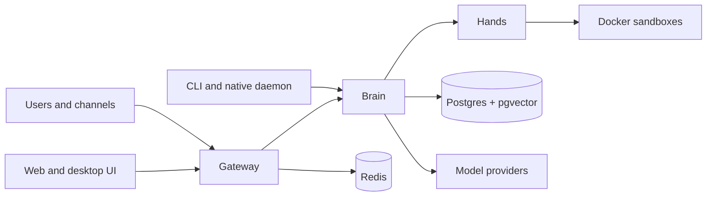

# Kestrel

[](https://github.com/John-MiracleWorker/Kestrel/actions/workflows/ci.yml)
[](LICENSE)

Kestrel is an autonomous AI agent platform that combines a Python reasoning core, a sandboxed execution service, channel-aware ingress, and multiple user surfaces across web, desktop, and native terminal workflows.

It can run in two practical modes today:

- Docker-first for bringing up the full stack quickly
- Native or hybrid for desktop-oriented development with local services and optional Docker-backed subsystems

> Current state: Kestrel is real and testable today, but most of the platform should still be treated as experimental. The strongest surfaces are web chat, task APIs, sandbox execution, provider configuration, and the native CLI/daemon path. Operator tooling, some service boundaries, and broader platform hardening are still in progress.

## What Exists Today

- `Gateway`: Fastify API, WebSocket transport, auth, workspaces, channel ingress, provider routes, automation routes, and webhook handling
- `Brain`: Python gRPC service for reasoning, task orchestration, memory, approvals, provider routing, workflows, and runtime policy
- `Hands`: Python gRPC sandbox executor with Docker isolation, permission checks, and structured audit records
- `Web`: React and Vite frontend for chat, tasks, settings, and operator-facing flows
- `Desktop`: Tauri wrapper around the web UI for a native desktop shell
- `CLI`: Python terminal interface with a full-screen TUI, REPL, daemon mode, task commands, memory commands, and skill pack management
- `Channels`: Web, Telegram, Discord, and WhatsApp adapters are wired; mobile support is only partial today

## Architecture


```mermaid
flowchart LR
    U[Users and channels] --> G[Gateway]
    W[Web and desktop UI] --> G
    C[CLI and native daemon] --> B
    G --> B[Brain]
    B --> H[Hands]
    B --> P[(Postgres + pgvector)]
    G --> R[(Redis)]
    B --> M[Model providers]
    H --> D[Docker sandboxes]
```

## Product Surfaces

### Service stack

| Package            | Role                                                                   |
| ------------------ | ---------------------------------------------------------------------- |
| `packages/gateway` | HTTP, WebSocket, auth, channel ingress, and API routing                |
| `packages/brain`   | Agent runtime, memory, workflows, provider routing, and task lifecycle |
| `packages/hands`   | Sandboxed execution, permission enforcement, and audit output          |
| `packages/shared`  | Protobuf contracts and shared typed schemas                            |

### User-facing surfaces

| Package            | Role                                                         |
| ------------------ | ------------------------------------------------------------ |
| `packages/web`     | Browser UI                                                   |
| `packages/desktop` | Tauri desktop shell                                          |
| `packages/cli`     | Native CLI, TUI, daemon, and local-first companion workflows |

## Maturity Snapshot

This is the practical summary of the current repo state:

- Usable but experimental: Docker Compose stack, JWT auth, workspaces, web chat, autonomous tasks, task event persistence, Hands sandbox execution, native host execution, provider configuration, and the main channel adapters
- Partially implemented: mobile push and sync helpers, memory graph inspection from the web UI
- Planned only: runtime profile inspector, fuller operator dashboard, and full end-to-end platform harnesses

For the detailed source of truth, see `docs/platform-capabilities.md`.

## Quick Start

### Option 1: Docker-first

This is the easiest way to bring up the full platform.

```bash
cp .env.example .env
docker compose up -d --build
```

Default local endpoints:

- Web UI: `http://localhost:5173`
- Gateway API: `http://localhost:8741`
- Brain gRPC: `localhost:50051`
- Hands gRPC: `localhost:50052`
- PostgreSQL: `localhost:5432`
- Redis: `localhost:6379`

### Option 2: Native or hybrid

This path is better when you want the desktop-first development profile or you want to keep only heavier subsystems inside Docker.

```bash
npm install
python3 -m venv venv
venv/bin/python -m pip install -r packages/brain/requirements.txt
venv/bin/python -m pip install -r packages/hands/requirements.txt
cp config/startup/native-hybrid.env.example config/startup/native-hybrid.env
./scripts/startup/native-hybrid.sh check
./scripts/startup/native-hybrid.sh up
```

Notes:

- `Hands` still depends on Docker even when you run it from a native shell because sandbox execution is container-backed.
- The native profile defaults host write and host exec tools to disabled until you provide an explicit policy file.
- On macOS, screen automation requires Screen Recording and Accessibility permissions.

## CLI And Native Workflow

The CLI package exposes a local-first companion surface in addition to the service stack.

Install it into the repo virtual environment:

```bash
venv/bin/python -m pip install -e packages/cli
```

Then use commands like:

```bash
kestrel
kestrel tui
kestrel repl
kestrel task "review auth module"
kestrel tasks
kestrel monitor
kestrel runtime
kestrel skill list
kestrel memory show
```

## Validation

Root validation commands:

```bash
npm run test
npm run typecheck
npm run lint
```

Useful package-level commands:

```bash
npm run dev --workspace=@kestrel/gateway
npm run dev --workspace=@kestrel/web
npm run test --workspace=@kestrel/gateway
npm run typecheck --workspace=@kestrel/web
cd packages/brain && ../../venv/bin/python -m pytest tests -v
cd packages/hands && ../../venv/bin/python -m pytest tests -v
```

## Documentation Map

- `SETUP.md`: end-to-end setup guide
- `docs/platform-capabilities.md`: what the repo supports today
- `docs/service-ownership.md`: intended service boundaries
- `docs/channel-support-matrix.md`: channel maturity and ingress status
- `docs/runtime-flags.md`: runtime switches and feature flags
- `docs/desktop-first-migration.md`: native and hybrid startup profile
- `docs/deep-scan-architecture-audit.md`: current architecture risks and next improvement targets

## Contributing

See `CONTRIBUTING.md` for development expectations, validation commands, and PR guidance.

## Security

See `SECURITY.md` for reporting guidance and scope.
