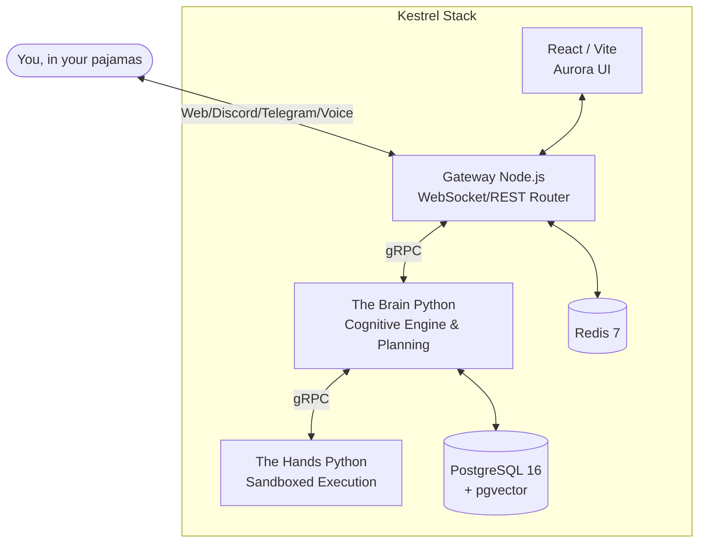

<p align="center">
  
  <h1 align="center">🦅 Kestrel (formerly Libre Bird)</h1>
  <p align="center"><strong>The dangerously autonomous, entirely self-hostable, slightly-too-smart AI agent platform.</strong></p>
  <p align="center">
    <a href="#-why-kestrel">Why Kestrel?</a> •
    <a href="#-the-brain">The Brain</a> •
    <a href="#-architecture">Architecture</a> •
    <a href="#-skills-and-tools">Skills</a> •
    <a href="#-quick-start">Quick Start</a>
  </p>
</p>

---

## 👋 Welcome to Kestrel!

Ever wanted an AI assistant that doesn't just reply to your messages, but actually thinks, argues with itself, spins up Docker containers, and executes real-world actions while you sip your coffee? Welcome to **Kestrel**.

We firmly believe your data should stay yours. Kestrel is a privacy-first, heavily-armed (with tools) AI engine that runs _entirely_ on your own infrastructure. You can hook it up to lightweight local MLX models on Apple Silicon, or plug in heavy hitters like Gemini, Claude, or GPT-4.

---

## ✨ Why Kestrel?

Because typical chatbots are boring. Kestrel has agency.

- � **Multi-Phase Cognitive Loop:** It doesn't just guess an answer. It accesses persistent memory, generates a multi-step plan, uses sandboxed tools, and reflects on whether it messed up.
- 🏛️ **The Council:** Got a highly complex prompt? Kestrel convenes a literal _Multi-Agent Debate_. The Architect, the Security Expert, the Implementer, and the Devil's Advocate will argue in real-time until they reach a consensus.
- �️ **See Everything:** The _KestrelProcessBar_ in the UI streams the agent's internal monologue, memory recalls, and council votes. Zero black boxes.
- 📦 **Sandboxed Toolkit:** A large built-in toolset (web, code, Git, browser, memory, automation) that can route risky work through the `Hands` sandbox.
- 📱 **Multi-channel, with uneven maturity:** Web is the strongest live surface today. Telegram, Discord, and WhatsApp are real but still being normalized. Mobile currently exposes push and sync helpers, not a complete channel surface.

---

## 🏗️ Architecture

Kestrel is built like a tank, split into clean, modular microservices (because monolithic "God objects" give us nightmares).


```mermaid
graph TD
    User([You, in your pajamas]) <-->|Web/Discord/Telegram/Voice| Gateway

    subgraph Kestrel Stack
        Gateway[Gateway Node.js<br>WebSocket/REST Router]
        Brain[The Brain Python<br>Cognitive Engine & Planning]
        Hands[The Hands Python<br>Sandboxed Execution]
        DB[(PostgreSQL 16<br>+ pgvector)]
        Cache[(Redis 7)]
        Frontend[React / Vite<br>Aurora UI]
    end

    Gateway <-->|gRPC| Brain
    Brain <-->|gRPC| Hands
    Brain <--> DB
    Gateway <--> Cache
    Frontend <--> Gateway
```

### The Core Microservices:

1. **The Brain (Python / gRPC):** Orchestrates planning, memory, approvals, task execution, provider routing, and background automation.
2. **The Hands (Python / gRPC):** Runs risky actions inside Docker sandboxes and returns execution audit data.
3. **The Gateway (Node.js / TS):** Handles auth, rate limits, WebSockets, webhook ingress, and channel normalization.
4. **The Frontend (React / Vite):** Primary human-facing web UI for chat, tasks, settings, and workspace management.

## 📋 Capability Status

- Current source-of-truth docs:
  [`docs/platform-capabilities.md`](docs/platform-capabilities.md),
  [`docs/service-ownership.md`](docs/service-ownership.md),
  [`docs/channel-support-matrix.md`](docs/channel-support-matrix.md),
  [`docs/runtime-flags.md`](docs/runtime-flags.md),
  [`docs/gateway-ingress-contract.md`](docs/gateway-ingress-contract.md)
- Strongest paths today: web chat, auth, workspaces, provider settings, and task start/list/approve/cancel.
- Real but still hardening: Hands sandbox execution, Telegram, Discord, WhatsApp, desktop native or hybrid startup.
- Experimental or partial: mobile push and sync helpers, operator dashboards, runtime profile inspection, and full per-channel maturity parity.

---

## 🧰 Skills and Tools

Kestrel comes equipped with enough tools to build an empire (or at least automate your inbox).

- **System & Code:** `python_executor`, `node_executor`, `shell_executor`, `github`, `system_monitor`, `computer_use`
- **Knowledge & Web:** `web`, `browser_automation`, `knowledge` (RAG), `wikipedia`
- **Productivity & Comm:** `email`, `calendar`, `meeting_summarizer`, `contacts`, `digest`
- **God-Tier Auto:** `self_improve` (Yes, it rewrites its own code), `moltbook_autonomous` (Background scheduling and automation).

---

## 🚀 Quick Start

Want to unleash Kestrel on your local network?

### Prerequisites

- Docker & Docker Compose
- LLM API Keys (OpenAI, Anthropic, or Google) **OR** a local GGUF model if you're feeling entirely off-grid.

### 1-2-3 Deploy

```bash
# 1. Grab the code
git clone https://github.com/John-MiracleWorker/Kestrel.git
cd Kestrel

# 2. Set up your secrets (Don't skip this or Kestrel gets cranky)
cp .env.example .env
code .env # Add your API keys and secure passwords
# Default recovery profile keeps the product layer in Core mode.
# Change KESTREL_FEATURE_MODE only when you explicitly want Ops or Labs features.

# 3. Fire it all up
docker compose up -d --build
```

_Boom._ Head over to **http://localhost:5173**. Your new hyper-capable assistant awaits.

---

## 🛠️ Development & Contributing

The codebase is meticulously typed and documented. We love PRs!

If you want to spin up services natively instead of in Docker:

```bash
# Terminal 1: Gateway
cd packages/gateway && npm install && npm run dev

# Terminal 2: Brain
cd packages/brain && pip install -r requirements.txt && python server.py

# Terminal 3: Frontend
cd packages/web && npm install && npm run dev
```

Run tests natively:

```bash
npm run test --prefix packages/gateway
pytest packages/brain/tests/
```

### Desktop-first native/hybrid startup profile

If you are migrating from Docker-first to desktop-first, use the documented startup profile:

```bash
cp config/startup/native-hybrid.env.example config/startup/native-hybrid.env
./scripts/startup/native-hybrid.sh check
./scripts/startup/native-hybrid.sh up
```

- `screen-agent` is enabled by default.
- Native runtime is selected.
- Feature mode defaults to `core`.
- Docker-heavy subsystems are optional.
- Native write/exec tools are disabled by default until policy is configured.

See the full migration guide and OS compatibility matrix in `docs/desktop-first-migration.md`.

---

## 🛡️ Security Note

Kestrel is _powerful_. It can run code and access your filesystem. The repo includes Row-Level Security migrations for workspace tables, Docker sandboxing for Hands, and JWT-based Gateway auth, but **please do not expose the Gateway port (8741) to the public internet** without a reverse proxy and TLS.

---

_Built with ❤️ (and entirely too much caffeine) by the Kestrel Team._
